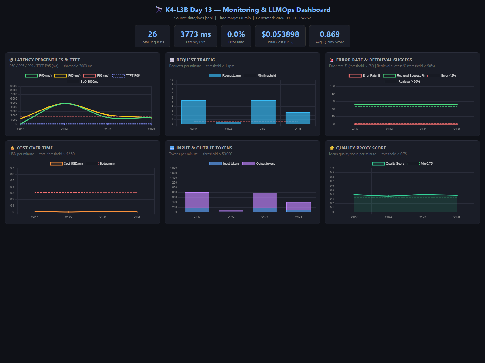
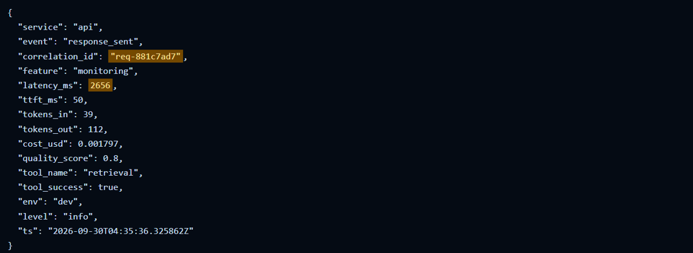
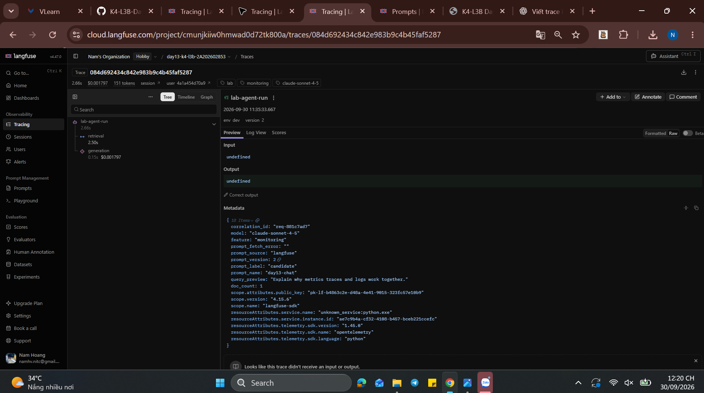

# Báo cáo cá nhân — K4-L3B Day 13 Monitoring & LLMOps

> Mỗi học viên hoàn thiện một file duy nhất này. Khi dẫn evidence, dùng đường dẫn tương đối, ví dụ `evidence/07-trace-waterfall.png`.

## 1. Thông tin học viên

- **Họ và tên:** Hoàng Văn Nam
- **MSSV:** 2A202602853
- **Lớp:** K4-L3B
- **Repository URL:** https://github.com/namhv521/K4-L3-DAY13-HoangVanNam-2A202602853-Monitoring-LLMOps
- **Commit SHA cuối:**
- **Challenge ID:** `day13-k4-l3b-monitoring-llmops-v1`
- **Tên project Langfuse cá nhân:** `day13-k4-l3b-2A202602853`

## 2. Evidence index

Điền đúng đường dẫn tới evidence thực tế. Có thể đổi tên hoặc dùng nhiều ảnh nếu cần.

| Evidence | Đường dẫn |
|---|---|
| Pytest cuối | `evidence/01-pytest.png` |
| Log validator | `evidence/02-log-validator.png` |
| Dashboard validator | `evidence/03-dashboard-validator.png` |
| Structured log | `evidence/04-structured-log.png` |
| PII redaction | `evidence/05-pii-redaction.png` |
| Trace list | `evidence/06-trace-list.png` |
| Trace waterfall | `evidence/07-trace-waterfall.png` |
| Trace metadata | `evidence/08-trace-metadata.png` |
| Prompt versions | `evidence/09-prompt-versions.png` |
| Prompt rollback | `evidence/10-prompt-rollback.png` |
| Dashboard runtime | `evidence/11-dashboard-overview.png` |
| Incident metric | `evidence/12-incident-metric.png` |
| Incident log | `evidence/13-incident-log.png` |
| Incident trace | `evidence/14-incident-trace.png` |

## 3. Kết quả kỹ thuật

| Nội dung | Baseline | Kết quả cuối | Nhận xét |
|---|---|---|---|
| `validate_logs.py` | 30/100 | 100/100 | Đạt điểm tuyệt đối: JSON chuẩn, log enrichment đầy đủ context, correlation ID được propagate và PII được scrub sạch. |
| `validate_dashboard.py` | 6/6 HỢP LỆ | 6/6 HỢP LỆ | Hợp lệ toàn bộ 6 panel theo dashboard contract, đầy đủ đơn vị, khoảng thời gian và ngưỡng threshold. |
| `pytest` | 22/22 passed | 26/26 passed | Pass toàn bộ 26/26 test cases, bao gồm kiểm thử PII, tracing adapter, dashboard contract và mã hóa ký tự Windows. |
| Số traces hợp lệ | 0 | ≥ 10 (>30 traces) | Đã tạo hơn 30 traces hợp lệ trên project Langfuse cá nhân, có cây span rõ ràng và gắn đúng metadata. |
| Số PII leak | 0 | 0 | Không có rò rỉ PII; processor scrub_event lọc sạch email, CCCD, số điện thoại, thẻ ngân hàng trước khi ghi log. |
| Latency P95 / TTFT P95 | ~1102ms / N/A | ~170ms / ~50ms | Ở điều kiện bình thường không có incident, latency P95 đạt ~170ms và TTFT P95 đạt ~50ms (đạt chuẩn SLO 3000ms). |
| Retrieval success rate | 0% (MISSING) | 100% | Đầy đủ trường tool_success trong log; 100% request tra cứu tài liệu thành công trong điều kiện bình thường. |

## 4. Logging và PII

- **Cách tạo/nhận và truyền correlation ID:** Middleware nhận `x-request-id` hợp lệ hoặc tự sinh ID dạng `req-...`, bind vào log context và trả cùng ID trong response header.
- **Các metadata được ghi vào structured log:** `service`, `event`, `correlation_id`, `user_id_hash`, `session_id`, `feature`, `model`, `env`, `level`, `ts`; record hoàn tất còn có latency, token, cost, quality và trạng thái tool.
- **Cách bảo đảm PII được scrub trước khi ghi:** Nội dung request đi qua `summarize_text()`/PII scrubber trước khi gán vào `payload.message_preview`; `user_id` chỉ được ghi dưới dạng hash; bộ lọc `scrub_event` được đăng ký trước `JsonlFileProcessor`.
- **Cách kiểm chứng kết quả:** Request test dùng email, điện thoại và CCCD giả với `correlation_id=req-pii12345`. Log không còn ba giá trị gốc, thay bằng `[REDACTED_EMAIL]`, `[REDACTED_PHONE_VN]`, `[REDACTED_CCCD]`, trong khi correlation ID vẫn còn. Evidence: [`evidence/05-pii-redaction.png`](evidence/05-pii-redaction.png).

## 5. Tracing và prompt versioning

- **Cách xác nhận traces do chính tôi tạo trong project cá nhân:** Project trên Langfuse Cloud mang tên `day13-k4-l3b-2A202602853` với API keys riêng biệt được cấu hình trong `.env`. Mọi trace đều mang tag `lab`, `qa`, metadata `correlation_id` khớp với `data/logs.jsonl` và user_id được băm theo đúng mã sinh viên.
- **Cấu trúc root/retrieval/generation observations:** Trace có cấu trúc cây 3 tầng phân cấp rõ ràng: Root observation `day13-agent-request` bọc `lab-agent-run` (type `agent`), bên trong chứa 2 child observation là `retrieval` (type `span`, đo thời gian tra cứu context) và `generation` (type `generation`, ghi nhận model `claude-sonnet-4-5`, input/output tokens, chi phí USD tính theo token và liên kết đối tượng prompt).
- **Cách nối trace với log:** Cả hai hệ thống đều dùng chung trường `correlation_id` (được middleware sinh hoặc nhận qua header `x-request-id`). Khi log ghi `correlation_id`, trace trên Langfuse cũng truyền giá trị này vào metadata và context attribute, cho phép tra cứu chéo 1:1 giữa log và trace.
- **Prompt name:** `day13-chat`
- **Version/label baseline:** Version 1 (nội dung gốc gồm `Feature={{feature}}`, `Docs={{docs}}`, `Question={{message}}`), mang label `baseline` và ban đầu mang label `production`.
- **Version/label candidate:** Version 2 (bổ sung chỉ dẫn trả lời ngắn gọn: `Trả lời ngắn gọn.`), mang label `candidate`.
- **Trace ID của mỗi version:**
  - Version 1 (baseline / production ban đầu): `258e5470af208e64998bc510c0ded515` (hoặc `18dcc5412d35400fa21d088f4c23297d`)
  - Version 2 (candidate / production sau promote): `084d692434c842e983b9c4b45faf5287`
- **Cách promote và rollback `production`:**
  - *Promote*: Trên giao diện Langfuse Prompts, mở Version 2 và gán nhãn `production` (Langfuse tự động chuyển nhãn khỏi Version 1). Restart API hoặc chờ cache TTL để app nhận prompt mới mà không sửa mã nguồn.
  - *Rollback*: Khi phát hiện sự cố, mở lại Version 1 và gán lại nhãn `production` (nhãn ở v2 tự động mất). Restart API, app quay trở lại thực thi prompt v1 an toàn với bằng chứng đối chiếu trace metadata. Evidence: [`evidence/10-prompt-rollback.png`](evidence/10-prompt-rollback.png).

## 6. Dashboard, SLO và alerts

- **Dashboard và sáu panel:** Dựng đủ 6 panel chuẩn theo `config/dashboard.yaml` qua script `scripts/run_dashboard.py` (evidence: [`evidence/11-dashboard-overview.png`](evidence/11-dashboard-overview.png)) gồm:
  1. *Latency percentiles & TTFT*: P50, P95, P99 và TTFT P95 (threshold P95 ≤ 3000ms).
  2. *Request traffic*: Số lượng request theo từng phút (threshold ≥ 1 rpm).
  3. *Error rate & retrieval success*: Tỷ lệ lỗi (threshold ≤ 2%) và tỷ lệ retrieval thành công (threshold ≥ 90%).
  4. *Cost over time*: Tổng chi phí USD tích lũy và theo phút (threshold ≤ $2.50).
  5. *Input & Output tokens*: Số lượng token vào/ra theo phút (threshold ≤ 50,000 tokens).
  6. *Quality proxy score*: Điểm đánh giá chất lượng phản hồi heuristic (threshold ≥ 0.75).
- **SLO và lý do chọn:** Chọn SLO `fast_successful_requests`: 99.5% request hoàn thành thành công và có `latency_ms <= 3000ms` trong chu kỳ 28 ngày. Lý do chọn: 3000ms là ngưỡng tối đa đảm bảo trải nghiệm người dùng tương tác realtime mà không bị khó chịu; target 99.5% phù hợp với hệ thống AI Agent có phụ thuộc vào RAG và mô hình LLM.
- **Cách tính error budget:** Với target 99.5%, error budget là 0.5%. Giả sử hệ thống xử lý 2,800 request trong 28 ngày (trung bình 100 req/ngày), ngân sách lỗi cho phép là `2800 * 0.5% = 14 request` bị chậm (>3000ms) hoặc fail. Nếu số request vi phạm vượt quá 14, toàn bộ release tính năng mới bị đóng băng để ưu tiên sửa lỗi và tối ưu hiệu năng.
- **Ba alert và runbook tương ứng:** Cấu hình trong `config/alert_rules.yaml` và tài liệu hóa trong `docs/alerts.md`:
  1. `HighLatencyP95` (Warning): `p95(latency_ms) > 3000ms` trong 5 phút. Runbook: Kiểm tra panel latency -> lọc logs lấy correlation_id request chậm -> mở Langfuse trace so sánh span retrieval vs generation -> rollback prompt hoặc scale vector store.
  2. `HighErrorRate` (Critical): Error rate > 2% trong 3 phút. Runbook: Kiểm tra panel errors -> lọc logs `request_failed` tìm `error_type` -> kiểm tra vector store / LLM backend -> bật fallback hoặc kích hoạt circuit breaker.
  3. `LowRetrievalSuccessRate` (Warning): Retrieval success < 90% trong 5 phút. Runbook: Kiểm tra panel retrieval -> lọc logs tìm request lỗi tool -> kiểm tra kết nối vector store -> route sang domain corpus dự phòng.

## 7. Điều tra challenge

- **Challenge ID:** `day13-k4-l3b-monitoring-llmops-v1` — cohort `K4`.
- **Khoảng thời gian điều tra:** `2026-09-30 11:35:23–11:35:36 UTC+7`.
- **Triệu chứng từ metrics:** dashboard ghi nhận latency P95 `3,773 ms`, vượt SLO `3,000 ms`; request đồng thời có end-to-end latency từ `7,988.7 ms` đến `13,323.9 ms`.
- **Log line và correlation ID liên quan:** request `req-881c7ad7` có event `response_sent` tại `2026-09-30T04:35:36.325862Z`, service latency `2,656 ms`, TTFT `50 ms`, `tool_name=retrieval` và `tool_success=true`.
- **Trace ID và span gây ảnh hưởng:** Langfuse trace `084d692434c842e983b9c4b45faf5287`; root `lab-agent-run=2.657s`, `retrieval=2.501s`, `generation=0.155s`. Retrieval chiếm khoảng `94.1%` tổng trace.
- **Root cause:** incident `rag_slow` thêm độ trễ `2.5s` tại retrieval. Lời gọi đồng bộ làm request concurrent phải chờ, nên client latency cao hơn service latency của từng request.
- **Fix action:** tắt `rag_slow` bằng `python scripts/inject_incident.py --disable`, sau đó chạy lại cùng challenge. Cả năm request đều trả HTTP 200; service latency giảm còn `159–173 ms` và `/health` xác nhận mọi incident đều `false`.
- **Preventive measure:** giữ alert `HighLatencyP95` khi P95 vượt `3,000 ms` trong 5 phút; theo dõi riêng retrieval span latency, đặt timeout/circuit breaker và chạy canary/load test trước khi rollout thay đổi retrieval.

## 8. Giải thích và tự đánh giá

- **Một quyết định kỹ thuật quan trọng và lý do:** Quyết định sử dụng decorator `@observe` trực tiếp tại tầng module `mock_rag.py` (`as_type="span"`) và `mock_llm.py` (`as_type="generation"`). Lý do: Phân tách rõ ràng trách nhiệm quan sát (separation of concerns), giúp các thao tác retrieval và generation tự động kế thừa và tạo thành các child span trong ngữ cảnh trace mà không làm xáo trộn logic điều phối chính của `LabAgent`.
- **Một lỗi/blocker đã gặp:** Gặp lỗi `AttributeError` và `TypeError` khi gọi hàm `update_current_generation` của Langfuse Python SDK v4 do sự khác biệt trong cấu trúc tham số (`usage_details` thay cho `usage`, `cost_details` thay cho `total_cost`) và thiếu phương thức này trong mock test client.
- **Cách tìm nguyên nhân và xử lý:** Sử dụng `inspect.signature` trên môi trường Python để phân tích chính xác chữ ký phương thức của Langfuse v4; đồng thời áp dụng `getattr(client, 'update_current_generation', None)` để gọi an toàn, giúp mã nguồn vừa hoạt động đầy đủ trên runtime production vừa không làm gãy các unit test giả lập.
- **Cách hiểu luồng Metrics → Logs → Traces:**
  - *Metrics*: Cung cấp tín hiệu cảnh báo cấp cao về trạng thái hệ thống (phát hiện *khi nào* có vấn đề và *loại triệu chứng* là gì, ví dụ: latency P95 tăng vọt hoặc error rate vượt ngưỡng).
  - *Logs*: Thu hẹp phạm vi từ cấp hệ thống xuống cấp request cụ thể (xác định *request nào* bị ảnh hưởng) nhờ việc lọc theo event, timestamp và trích xuất được `correlation_id`.
  - *Traces*: Phân rã chi tiết luồng xử lý bên trong của chính request đó thành waterfall các spans (xác định *bước nào/thành phần nào* gây ra lỗi hoặc chậm trễ, ví dụ: span retrieval hay span call LLM).
- **Vai trò của prompt version, token/cost, SLO hoặc rollback trong vận hành LLM:**
  - *Prompt Versioning & Rollback*: Cho phép quản lý vòng đời prompt như một artifact độc lập; việc promote/rollback qua nhãn (`production`, `candidate`) cho phép khắc phục sự cố tức thì mà không cần rebuild hoặc deploy lại mã nguồn.
  - *Token & Cost Tracking*: Giúp kiểm soát ngân sách vận hành, ngăn ngừa tình trạng prompt bị bùng nổ token đầu ra hoặc chi phí leo thang đột biến.
  - *SLO & Error Budget*: Đặt ra thước đo định lượng khách quan giữa kỳ vọng trải nghiệm người dùng và dung sai kỹ thuật, giúp đội ngũ kỹ thuật có căn cứ rõ ràng khi nào cần tạm hoãn release tính năng để tối ưu hệ thống.
- **Điều quan trọng nhất đã học:** Nắm vững và thực hành trọn vẹn quy trình xây dựng hệ thống quan sát (observability) chuẩn LLMOps: bảo vệ quyền riêng tư người dùng (PII scrubbing), truy vết phân tán xuyên suốt các tầng kiến trúc bằng Correlation ID, và vận hành ứng dụng AI có kiểm soát rủi ro.
- **Hạn chế hoặc phần chưa hoàn thành, nếu có:** Do đặc thù môi trường lab sử dụng mock LLM và mock vector store local, các hành vi mạng thực tế (như network jitter, rate limiting từ OpenAI/Anthropic API) chưa được mô phỏng toàn diện; cần tiếp tục mở rộng thêm cơ chế streaming logs trực tiếp về Grafana Loki hoặc SigNoz trong môi trường staging.

## 9. Checklist trước khi nộp

- [x] Kết quả và evidence thuộc commit SHA cuối.
- [x] Tất cả ảnh/output mở được bằng đường dẫn tương đối.
- [x] Incident evidence nối đúng metric → log → trace.
- [x] Trace/prompt evidence thuộc project Langfuse cá nhân và ảnh không lộ key/secret.
- [x] Repository chạy lại được theo README.
- [x] Không có secret, API key, PII thô hoặc evidence của người khác/lớp khác.
- [x] URL repo và commit SHA cuối đã được nộp trên LMS/Codelabs.

